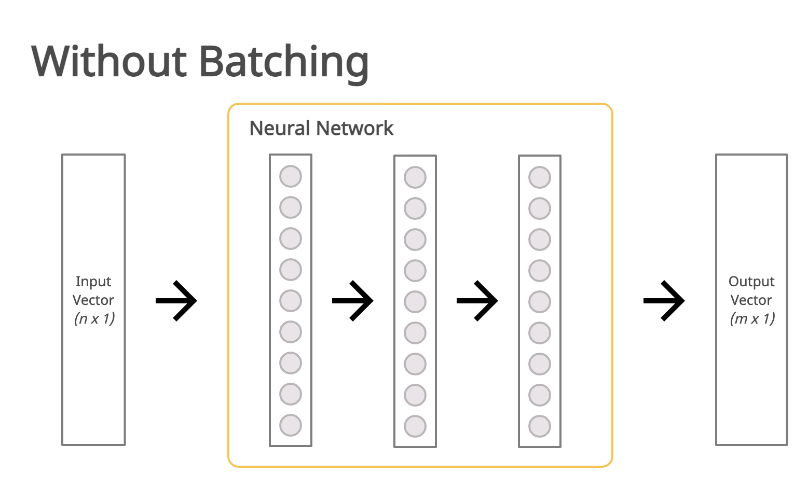
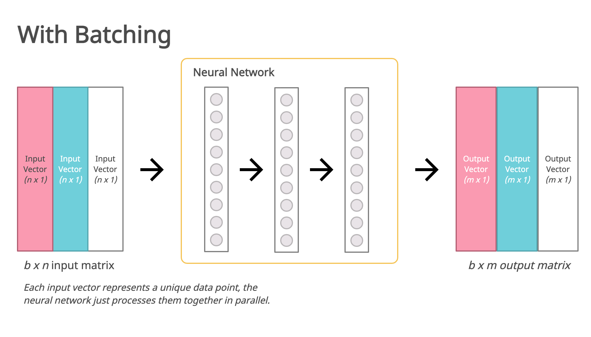

# Week 6 Practice Problems

Please read the following sections and complete the corresponding tasks by the next meeting.

This week's problems are split up into four sections: defining a model, creating a dataset pipeline, setting up training, and writing a training loop. Together, they will allow you to create and train MLPs on introductory machine learning tasks/datasets.

## Defining a Model

### Introduction

The core of the MLP is the perceptron layer, defined by the equation `F(x; θ) = σ(θ_1 x + θ_2)`, where `θ_1` is the weight matrix, `θ_2` is the bias vector, and `σ` is the sigmoid nonlinearity function. Recall that `x` is a vector input, so the product `θ_1 x` is calculated using matrix multiplication.

The perceptron layer is implemented in TensorFlow as the `tf.keras.layers.Dense` class. It is fairly easy to use: the below code creates a perceptron `Dense` layer with 100 stacked perceptrons ("neurons") and a sigmoid activation.

```python
layer = tf.keras.layers.Dense(100, activation="sigmoid")
```

In order to pass data through the `layer`, simply call `layer` as a function:

```python
x = ...  # some input data
output = layer(x)
```

(An important note about dimensions: while MLP layers are defined to accept vectors as inputs (i.e., their input shape should be (n,), which corresponds to an n-dimensional vector), in practice, `Dense` layers accept a (b, n) matrix as input. The reason for this is batching: recall that stochastic gradient descent calls for us to split the dataset into random partitions, called "batches". Crucially, *every element in a batch is processed at the same time*. This means that if we have a batch of 128 dataset input elements, each of which is an n-D vector, the neural network will in reality operate on a 128 x n dimensional matrix- a 128-length list of n-dimensional vectors. Each of the n-D vectors represents a unique datapoint, we've just grouped them together into a matrix. The purpose of this batching is to speed up computations: it is much faster to process the 128 examples in parallel than sequentially. See below for a diagram.)

|  |  |
|------------------------------|---------------------------|

Test this out by calling `layer` on a vector `np.zeros((100,))`. What error do you get? Now, try calling `layer` on a matrix `np.zeros((128, 100))`. What happens now? Notice that the first dimension of the input matrix is the same as the first dimension of the output matrix: the so-called "batch dimension" does not change throughout the network. (Solution: the output shape is (b, n), where b is the batch size (128 here) and n is the number of neurons in our layer.)

To create a full neural network consisting of multiple layers, we need to use the `tf.keras.layers.Input` layer. This merely acts as a placeholder to represent the input to a neural network and properly define its input shape:

```python
input_layer = tf.keras.layers.Input((20,))  # (20,) is the input data's shape
```

Note that the batch dimension is excluded from the input layer's input shape. Hence, in the above code, the neural network will expect a (b, 20) dimensional matrix rather than a 20-D vector.

To use the `input_layer` we've created in conjunction with `Dense` layers, simply call the `Dense` layers on the `input_layer`:

```python
output = layer(input_layer)  # use the layers we previously defined
```

Then, to finalize the model, use the `tf.keras.Model` API:

```python
model = tf.keras.Model(inputs=[input_layer], outputs=[output])
```

This creates a full neural network that can be called on input data with shape (b, 200) and will output a matrix with shape (b, 100). Note that unlike the constants 200 and 100, `b` can vary depending on the input data: we usually denote this variable dimension with `None`, so the input shape becomes (`None`, 100) and the output shape (`None`, 200).

Below is an example of creating a neural network with 3 layers. Can you identify the input shape, the output shape, and the number of MLP layers?

```python
input_x = tf.keras.layers.Input((10,))
x = tf.keras.layers.Dense(20, activation="sigmoid")(input_x)
x = tf.keras.layers.Dense(50, activation="sigmoid")(x)
x = tf.keras.layers.Dense(100, activation="softmax")(x)
model = tf.keras.Model(inputs=[input_x], outputs=[x])
```

(A quick aside: `softmax` is a special activation function that will output a probability distribution based on the relative sizes of the neuron outputs. This means that each neuron's output is in the range (0, 1), their outputs will sum to 1, and the neurons with the largest output values will have the largest probabilities. `softmax` is useful for scenarios in which we want to assign a particular class label ("dog", "cat", "orange", "apple", etc) to an input data point: each neuron will correspond to each class label and will output the probability that the input belongs to that class.)

Using this knowledge, we're going to train a neural network to recognize handwritten digits: the classic "Hello World" problem for AI. Specifically, given a 28x28 grayscale (black and white) image of a handwritten digit (`None`x28x28 including the batch dimension), the neural network needs to learn to classify the digit as 0, 1, 2, 3, 4, 5, 6, 7, 8, or 9. Therefore, the MLP should have a softmax output layer with 10 output neurons, where the n-th neuron corresponds to the probability that the image contains the n-th digit. Because `Dense` layers expect a (`None`, `num_neurons`) input matrix, and the images are (`None`, 28, 28), we must [`reshape`](https://www.tensorflow.org/api_docs/python/tf/reshape) the input to (`None`, 28 * 28) = (`None`, 784). `reshape` does not change the underlying data in the image. it just changes the shape (dimensions) of the data.

### Task
Now, create our digit classifying neural network: it should have be a 3-layer MLP with an input shape of (`None`, 784) and three `Dense` layers, with 100, 100, and 10 neurons, respectively. Set the `activation` functions of the first two `Dense` layers to `sigmoid`, and set the third's `activation` to `softmax`.

## Creating a dataset pipeline

### Introduction

To train our neural network, we're going to use the [MNIST dataset](https://www.tensorflow.org/datasets/catalog/mnist). In order to use the dataset in the most effective way possible, please install the Python package `tensorflow-datasets` with `pip`. After doing so, load the MNIST data:

```python
import tenosrflow_datasets as tfds
ds = tfds.load("mnist", split="train", shuffle_train=True)
```

This will load the MNIST dataset into the `ds` variable. `split=Train` means that we get the training data, and `shuffle_train=True` means that we shuffle the training data. Next, we have to shuffle and batch the datset to prepare it for training:

```python
ds = ds.shuffle(buffer).batch(batch_size)
```

`shuffle` will shuffle `buffer` elements of the dataset at a time, and `batch` will split the dataset into sections containing `batch_size` examples each. To view the data, just iterate over the dataset with a simple `for` loop:

```python
for batch in ds:
    images = batch["image"]
    labels = batch["label"]
    print(images.shape, labels.shape)  # (b, 28, 28, 1) and (b,)
    break
```

Note that the `images` has shape (b, 28, 28, 1)- the extra 1 at the end can be ignored. Each pixel in `images` is in the range [0, 255]. The `labels` has shape (b,), indicating that it contains one number per example in the batch. That number corresponds to the correct digit for each image in the `images` batch; we will use these labels to train the MLP we defined earlier.

Now, we need to preprocess the data for training: do so by `reshape`ing the images to have shape (b, 784) so they are compatible with our MLP, and then divide `images` by 255 to make sure all the pixels are in the range [0, 1] rather than [0, 255]. This helps the MLP learn, as [0, 1] is the range of every output layer (due to sigmoid) so it makes sense that the input layer expects a range of [0, 1] values as well.

Next, notice that our labels aren't currently usable by our network. Remember than our MLP outputs a 10-D vector (ignoring the batch dimension) corresponding to the network's probabilities for each digit: for example, if the network is given an image that contains the digit 3, the output might be the vector `[0.05, 0.05, 0.01, 0.83, 0.01, 0.01, 0.01, 0.01, 0.01, 0.01]`. However, the labels provided are not vectors- instead, they're just scalars representing the correct digit. In the example, the label would just contain the number `3`. We need to convert this scalar label to a probability distribution over the digits; i.e., `[0, 0, 0, 1, 0, ...]` for `3`. To do so, use [`tf.one_hot`](https://www.tensorflow.org/api_docs/python/tf/one_hot) with `depth=10`.

### Task
Using the `for batch in ds` loop, write the data preprocessing code as specified above (i.e., reshape and normalize the images, and convert scalar labels into vectors). Verify that the `images` variable has a shape of (b, 784) and that the `labels` variable has a shape of (b, 10). Reason through why these shapes should make sense. After preprocessing the data, we are ready to move onto setting up our training.

## Setting up training

### Introduction
Before we start training, we must choose three things: learning rate, number of epochs, and loss function. Recall that learning rate controls the size of the update during gradient descent; a smaller learning rate will correspond to slower but generally more stable training, and a higher learning rate will correspond to faster but generally more noisy training. A good value for this dataset is 1e-4. The number of epochs is just how many times we will iterate over the training set; a good value is 10 for our dataset. The loss function we're using is called cross-entropy: roughly, it measures the distance between two probabilities distributions (i.e., the distance between the predicted distribution over the digits and the true label distribution). We can compute cross-entropy between a batch of true labels `y_true` and MLP predictions `y_pred` via `tf.keras.losses.categorical_crossentropy(y_true, y_pred)`, which returns a (b,) vector corresponding to the cross-entropy loss between each predicted output and its correct label in the batch.

### Task
For each batch in the dataset, use the MLP previously defined to predict on the `images` and then compute the categorical cross-entropy between the predicted values and the true `labels`. These loss values represent the network's performance when the network is untrained: during training, this value should decrease.

##  Training loop

### Introduction
Now that we have our model, dataset, and training parameters defined, we can train our model. To do so, we must write a training loop, which takes the below general form:

```python
for epoch in range(epochs):
    for batch in ds:
        ... # get image and true label
        ... # preprocess image and true label
        with tf.GradientTape() as tape:
            ... # run model on image to get y_pred
            ... # calculate loss between true label and y_pred
        grads = tape.gradient(loss, model.trainable_weights)
        for grad, param in zip(grads, model.trainable_weights):
            ... # apply SGD update to each param using grad
                # refer to Numerical Computation slides for SGD update equation
                # hint: param is a tf.Variable, check out the docs on how to 
                # update it (param = new_val won't work here!)
    predict_and_disp(ds, model)  # helper function already written
```

### Task
Fill in the above code with the code you've written from the previous three sections. You will need to run `from util import predict_and_disp` in order to use `predict_and_disp`, where `util.py` is the file included in this repo. Check that the loss decreases and that `predict_and_disp` gives reasonable predictions. Afterwards- congratulations! You've trained your first neural network :blush: .
